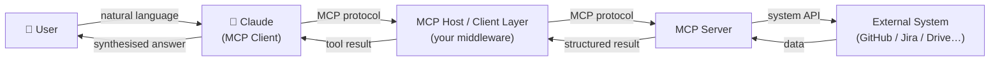
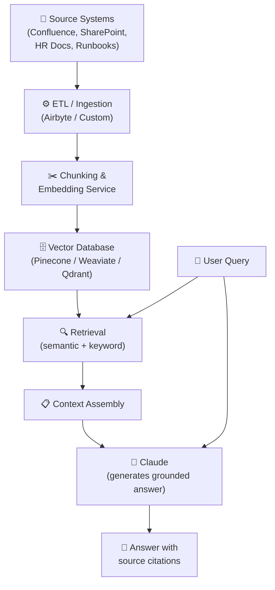
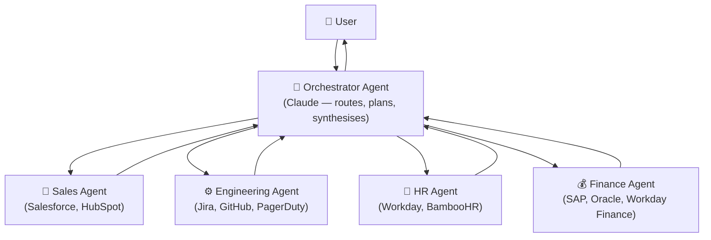
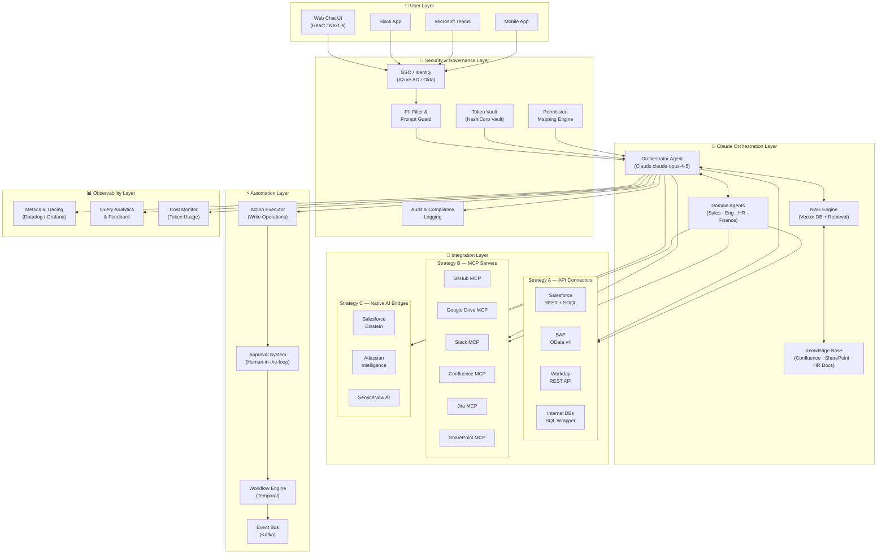

# 🏗️ Enterprise AI Hub Architecture — Powered by Claude

> A blueprint for building a unified, enterprise-grade AI chat and automation interface that connects every business system through Claude as the orchestration brain.

---

## Table of Contents

1. [Core Philosophy](#1-core-philosophy)
2. [Claude as the Central Brain](#2-claude-as-the-central-brain)
3. [Three Integration Strategies](#3-three-integration-strategies)
   - [Strategy A: Direct API Integration](#strategy-a-direct-api-integration)
   - [Strategy B: MCP Servers](#strategy-b-mcp-model-context-protocol-servers)
   - [Strategy C: Native AI in Business Systems](#strategy-c-leverage-native-ai-in-business-systems)
4. [Security & Governance](#4-security--governance)
5. [Enterprise Knowledge Layer (RAG)](#5-enterprise-knowledge-layer-rag)
6. [Automation Engine](#6-automation-engine)
7. [Multi-Agent Evolution](#7-multi-agent-evolution)
8. [Observability & Continuous Improvement](#8-observability--continuous-improvement)
9. [Decision Matrix](#9-decision-matrix)
10. [Complete Architecture Diagram](#10-complete-architecture-diagram)
11. [Team Structure](#11-team-structure)
12. [Technology Stack Summary](#12-technology-stack-summary)
13. [Getting Started — First 30 Days](#13-getting-started--first-30-days)
14. [Phased Roadmap](#14-phased-roadmap)

---

## 1. Core Philosophy

The Enterprise AI Hub is built on a single, clear principle: **one interface for every system, with Claude as the brain**.

Rather than training employees to navigate Salesforce, Jira, Confluence, SAP, and Workday separately, the hub provides a single natural-language chat surface. Employees ask questions or request actions; Claude figures out which systems to query, calls them, and synthesises a coherent answer.

Three complementary integration strategies make this possible:

| Strategy | Mechanism | Best For |
|---|---|---|
| **A — Direct API Integration** | Claude calls system REST/GraphQL/OData APIs via tool use | Critical systems, write access, sensitive data |
| **B — MCP Servers** | Claude connects to Model Context Protocol servers | Standard read/search patterns, growing ecosystem |
| **C — Native AI in Business Systems** | Salesforce Einstein, Atlassian Intelligence, ServiceNow AI handle domain tasks; Claude synthesises | AI-enriched results from best-of-breed specialised models |

These strategies are **not mutually exclusive** — most enterprises will use all three.

---

## 2. 🧠 Claude as the Central Brain

### Why Claude for Enterprise

| Capability | Detail |
|---|---|
| **200K context window** | Ingest large documents, long conversation history, and multi-system payloads in a single call |
| **Native tool use** | Claude natively understands JSON tool definitions and decides which tools to call — no extra plumbing |
| **Structured output** | Reliably returns JSON, tables, or any schema your downstream system expects |
| **MCP support** | First-class citizen in the Model Context Protocol ecosystem |
| **Enterprise API** | Anthropic API with usage controls, audit hooks, and AWS Bedrock deployment options |

### Claude's Native Tool-Use Capability

Claude routes queries to the right systems by selecting from a set of tool definitions you register at call time. This eliminates a separate intent-classification step — Claude decides which tools to call and with what parameters as part of a single reasoning pass.

#### Python Example — Registering Tools with the Anthropic SDK

```python
import anthropic

client = anthropic.Anthropic()

tools = [
    {
        "name": "get_salesforce_opportunity",
        "description": "Retrieve a Salesforce opportunity by account name or opportunity ID.",
        "input_schema": {
            "type": "object",
            "properties": {
                "account_name": {"type": "string", "description": "Account name to search for"},
                "opportunity_id": {"type": "string", "description": "Salesforce opportunity ID"}
            }
        }
    },
    {
        "name": "get_jira_tickets",
        "description": "Retrieve Jira issues for a project or account, optionally filtered by status or priority.",
        "input_schema": {
            "type": "object",
            "properties": {
                "project_key": {"type": "string"},
                "account_name": {"type": "string"},
                "priority": {"type": "string", "enum": ["P1", "P2", "P3", "P4"]},
                "status": {"type": "string"}
            },
            "required": ["project_key"]
        }
    },
    {
        "name": "search_confluence",
        "description": "Search Confluence for documentation, policies, or runbooks.",
        "input_schema": {
            "type": "object",
            "properties": {
                "query": {"type": "string"},
                "space_key": {"type": "string"}
            },
            "required": ["query"]
        }
    }
]

response = client.messages.create(
    model="claude-opus-4-5",
    max_tokens=4096,
    tools=tools,
    messages=[{
        "role": "user",
        "content": "What's the status of the Acme deal and are there any blocking P1 tickets?"
    }]
)

# Claude returns tool_use blocks; your code executes each tool and feeds results back
for block in response.content:
    if block.type == "tool_use":
        result = execute_tool(block.name, block.input)   # your dispatcher
        # append tool_result to the conversation and call Claude again
```

### Example Flow — Multi-System Query

```
User: "What's the status of the Acme deal and are there any blocking engineering tickets?"

Claude reasons:
  1. Call get_salesforce_opportunity(account_name="Acme")
     → Stage: Negotiation, Value: $500K, Close date: 2024-03-31

  2. Call get_jira_tickets(project_key="ACME", priority="P1", status="Open")
     → 2 blocking P1 tickets: AUTH-441, PERF-109

  3. Synthesise:
     "The Acme deal is in Negotiation at $500K, expected to close 31 Mar.
      There are 2 open P1 tickets (AUTH-441: OAuth token expiry; PERF-109:
      API latency spike) that the engineering team has flagged as blockers."
```

---

## 3. Three Integration Strategies

### Strategy A: Direct API Integration

#### When to Use
- Systems that require **write access** (create tickets, update records, trigger workflows)
- **Highly sensitive data** that must not pass through a third-party MCP server
- Systems with **no MCP server available** yet
- Custom internal microservices and databases

#### Example Systems

| System | Protocol | Key Operations |
|---|---|---|
| Salesforce | REST + SOQL | Opportunities, Accounts, Cases, Forecasts |
| SAP S/4HANA | OData v4 / RFC | Finance, Procurement, Inventory |
| Internal Databases | SQL (via API wrapper) | Business-specific data, reporting |
| Custom Microservices | REST / gRPC | Internal services, real-time data feeds |
| Workday | REST API | HR, Payroll, Organisational data |

#### Pros & Cons

| ✅ Pros | ❌ Cons |
|---|---|
| Full control over auth, retry, and error handling | More engineering effort per connector |
| Supports write operations and complex transactions | Connectors must be maintained as APIs evolve |
| No dependency on third-party MCP server quality | Scaling requires careful rate-limit management |
| Works for any system with an API | |

---

### Strategy B: MCP (Model Context Protocol) Servers

[MCP](https://modelcontextprotocol.io) is Anthropic's open standard for connecting AI models to external data sources and tools. Instead of writing bespoke tool-calling glue code for every system, you deploy (or build) an MCP server that speaks a standard protocol Claude understands natively.

#### MCP Architecture



#### Available & Emerging MCP Servers

| System | MCP Server Status | Notes |
|---|---|---|
| Google Drive | ✅ Available | Anthropic reference implementation |
| Slack | ✅ Available | Anthropic reference implementation |
| GitHub | ✅ Available | Anthropic reference implementation |
| PostgreSQL / MySQL | ✅ Available | Anthropic reference implementation |
| Confluence | 🔨 Emerging | Community / Atlassian-maintained |
| Jira | 🔨 Emerging | Community / Atlassian-maintained |
| SharePoint / OneDrive | 🔨 Emerging | Microsoft ecosystem |
| Salesforce | 🔨 Emerging | Salesforce-maintained |
| ServiceNow | 🔨 Emerging | ServiceNow-maintained |

#### What Your Engineers Build

1. **MCP Host / Client Layer** — middleware that brokers communication between Claude and your MCP servers, handles auth token injection, and enforces access policies.
2. **Custom MCP Servers** — for internal systems that have no public MCP server yet. Each server exposes tools, resources, and prompts in the MCP schema.
3. **Security Middleware** — validates that every MCP request carries the correct user-scoped credentials before forwarding to the external system.

#### Pros & Cons

| ✅ Pros | ❌ Cons |
|---|---|
| Standard protocol — less glue code per system | MCP ecosystem is still maturing |
| Claude is natively optimised for MCP tool use | Custom MCP servers still require engineering effort |
| Community servers for common systems already exist | Read-heavy; write support varies by server |
| Easy to swap or upgrade servers independently | Additional network hop vs direct API |

---

### Strategy C: Leverage Native AI in Business Systems

Salesforce Einstein, Atlassian Intelligence, ServiceNow AI, and Microsoft Copilot each have **deep domain models** trained on years of business data. Rather than replacing them, the hub uses them as specialised subagents and lets Claude synthesise their outputs.

#### Example Flow — Deal Health + Delivery Risk

```
User: "Is the Acme deal likely to close this quarter, and what's the delivery risk?"

Claude calls:
  1. Salesforce Einstein API → deal close probability: 78%, risk factors: long sales cycle
  2. Atlassian Intelligence API → 3 open epics at risk, estimated delay: 2 weeks

Claude synthesises:
  "Einstein rates the Acme deal at 78% close probability for Q2. However,
   Atlassian Intelligence flags 3 delivery epics as at-risk with a ~2-week
   estimated slip. Closing on time may depend on resolving EPIC-204."
```

#### Pros & Cons

| ✅ Pros | ❌ Cons |
|---|---|
| Best-of-breed AI for each domain | Dependent on each vendor's AI quality and API availability |
| Less effort than replicating domain models | Vendor lock-in for analytical outputs |
| Native data access within the system | Additional licensing cost per AI feature |
| Continuously improved by the vendor | Limited control over model behaviour |

---

## 4. 🔐 Security & Governance

### Identity & Access

- **SSO Integration**: All hub users authenticate via your enterprise IdP (Azure AD / Okta). The hub never stores passwords.
- **Token Vaulting**: Per-system OAuth tokens are stored in a secrets manager (HashiCorp Vault / AWS Secrets Manager) and injected at request time.
- **Per-User Permission Mapping**: Every API call is made with the end-user's scoped token, not a service account. A sales rep cannot see HR salary data — even through the hub — because their Workday token lacks that scope.

### Data Protection

| Concern | Mechanism |
|---|---|
| **Data residency** | Deploy Claude via AWS Bedrock or Azure AI to keep data within your cloud region |
| **PII & sensitive data** | Pre-response filter strips or masks PII before surfacing to users; configurable per data class |
| **Audit logging** | Every query, tool call, system accessed, and response stored in an immutable audit log |
| **Prompt injection** | Input sanitisation layer + system prompt hardening to prevent user-injected instructions from overriding governance rules |

### Claude Deployment Decision

| Factor | Anthropic API (Direct) | AWS Bedrock |
|---|---|---|
| **Data residency** | Anthropic servers (US) | Your AWS region |
| **Compliance (HIPAA, SOC2, GDPR)** | Anthropic DPA required | AWS compliance programmes apply |
| **Integration effort** | Minimal | Moderate (IAM, VPC config) |
| **Model availability** | Latest Claude models immediately | Slight lag on new model releases |
| **Cost model** | Per-token | Per-token (same pricing) |
| **Best for** | Startups, fast iteration | Regulated industries, existing AWS footprint |

---

## 5. 📚 Enterprise Knowledge Layer (RAG)

### RAG Pipeline



### Technology Recommendations

| Component | Options |
|---|---|
| **ETL / Ingestion** | Airbyte, Fivetran, custom Python pipelines |
| **Embedding Model** | Amazon Titan Embeddings, OpenAI `text-embedding-3-large`, self-hosted `bge-large` |
| **Vector Database** | Pinecone (managed), Weaviate (open-source), Qdrant (self-hosted), Azure AI Search |
| **Chunking Strategy** | Recursive character splitting + overlap; semantic chunking for long documents |
| **Re-ranking** | Cohere Rerank or cross-encoder for precision improvement |

### Two Query Modes

| Mode | When to Use | Example |
|---|---|---|
| **Live** | Current operational data | "What is the Acme deal status right now?" |
| **Knowledge** | Reference, policy, or historical data | "What is our remote-work policy?" |

Claude selects the appropriate mode automatically based on query intent, or both modes are combined when the answer requires real-time data enriched with background context.

---

## 6. ⚡ Automation Engine

### Capability Progression

| Tier | Capability | Example | Timeline |
|---|---|---|---|
| **1 — Read** | Query & summarise data | "Show me all open P1 tickets" | Month 1–3 |
| **2 — Write** | Single-system actions | "Create a Jira ticket for this bug" | Month 3–6 |
| **3 — Chain** | Multi-step cross-system workflows | "When deal closes: create onboarding project, notify CS in Slack, update SAP forecast" | Month 4–6 |
| **4 — Smart** | Event-driven, autonomous workflows | Auto-escalate tickets when SLA is at risk based on Salesforce close date | Month 6–12 |

### Safety Mechanisms

- **Human-in-the-loop approval**: Write and chain actions require user confirmation before execution (configurable by action type).
- **Dry-run mode**: All write operations can be previewed before committing.
- **Scope limits**: Each tool definition explicitly restricts which records/systems can be mutated.
- **Rollback hooks**: Reversible actions (e.g., Jira ticket creation) register a compensating action that can undo the change.

---

## 7. 🧩 Multi-Agent Evolution

As the hub matures, a single orchestrator Claude instance is augmented by specialised domain agents. Each domain agent has deep system knowledge, its own tool set, and can be developed by different teams.

### Multi-Agent Architecture



### Inter-Agent Communication

- The orchestrator decomposes complex queries into sub-tasks and delegates to the appropriate domain agent.
- Domain agents return structured JSON results that the orchestrator merges and presents.
- Agents communicate via an internal message bus (Kafka / Azure Service Bus) for event-driven workflows.
- Each domain agent maintains its own system prompt, tool registry, and RAG index.

---

## 8. 📊 Observability & Continuous Improvement

| Metric | Purpose | Target |
|---|---|---|
| **Query success rate** | % of queries answered without error or fallback | > 95% |
| **Response latency (P95)** | End-to-end time from user query to rendered answer | < 5 s |
| **Tool call accuracy** | % of tool calls that return the expected data without retry | > 98% |
| **User satisfaction (CSAT)** | Thumbs-up/down rating per response | > 80% positive |
| **Token cost per query** | Average Claude token spend | Tracked for budget |
| **RAG retrieval precision** | % of retrieved chunks relevant to the query | > 85% |
| **Automation success rate** | % of write/chain actions completed without manual intervention | > 90% |
| **Audit coverage** | % of queries with complete audit trail | 100% |

---

## 9. Decision Matrix

| System | Recommended Strategy | Rationale |
|---|---|---|
| **Salesforce** | Strategy A (API) + Strategy C (Einstein) | Write access required; Einstein for predictions |
| **Jira** | Strategy B (MCP) + Strategy A for writes | MCP server maturing; direct API for ticket creation |
| **Confluence** | Strategy B (MCP) | Strong MCP server; primarily read/search |
| **SAP S/4HANA** | Strategy A (OData API) | Complex transactions; no mature MCP server |
| **Workday** | Strategy A (REST API) | Sensitive HR data; strict access controls needed |
| **GitHub** | Strategy B (MCP) | Anthropic reference MCP server available |
| **Google Drive / Docs** | Strategy B (MCP) | Anthropic reference MCP server available |
| **Slack** | Strategy B (MCP) | Anthropic reference MCP server available |
| **SharePoint** | Strategy B (MCP) | Emerging Microsoft MCP server |
| **ServiceNow** | Strategy A (REST API) + Strategy C (native AI) | Complex ITSM workflows; ServiceNow AI for predictions |
| **Internal Databases** | Strategy A (SQL via API wrapper) | No public MCP; sensitive/proprietary data |
| **Custom Microservices** | Strategy A (REST/gRPC) | Bespoke; direct integration most reliable |

---

## 10. Complete Architecture Diagram



---

## 11. Team Structure

| Role | Responsibility | Headcount |
|---|---|---|
| **Tech Lead / Architect** | Overall architecture, design decisions, standards | 1 |
| **AI / LLM Engineer** | Claude integration, prompt engineering, RAG, agent framework | 2–3 |
| **Backend Engineer — Connectors** | API connectors (Salesforce, SAP, Workday), MCP server builds | 2–3 |
| **Backend Engineer — Platform** | Auth, token vault, permission mapping, security middleware | 1–2 |
| **Data Engineer** | ETL pipelines, vector DB, knowledge base ingestion | 1–2 |
| **Frontend Engineer** | Chat UI (React/Next.js), Slack and Teams integrations | 1 |
| **Platform / DevOps Engineer** | Kubernetes, CI/CD, monitoring, secrets management | 1–2 |
| **Product Owner** | Roadmap, prioritisation, stakeholder management, user feedback | 1 |
| **Total** | | **10–14** |

---

## 12. Technology Stack Summary

| Layer | Recommended Technologies |
|---|---|
| **Frontend** | React / Next.js, WebSocket for streaming responses |
| **AI Orchestration** | Anthropic Claude API (claude-opus-4-5 / claude-sonnet-4-5) or AWS Bedrock |
| **Agent Framework** | Anthropic SDK (tool use + MCP), LangGraph for complex agent graphs |
| **MCP Host / Client** | Anthropic MCP SDK, custom host middleware |
| **Vector Database** | Pinecone (managed), Weaviate or Qdrant (self-hosted) |
| **Embedding Model** | Amazon Titan Embeddings, `text-embedding-3-large` |
| **ETL / Ingestion** | Airbyte, Fivetran, custom Python/Typescript pipelines |
| **Secrets / Token Vault** | HashiCorp Vault, AWS Secrets Manager |
| **Workflow Engine** | Temporal, Apache Airflow |
| **Event Bus** | Apache Kafka, Azure Service Bus |
| **Auth / SSO** | Azure AD / Okta (OAuth 2.0 + OIDC) |
| **Audit & Logging** | Immutable audit log (S3 + Athena), Datadog, Splunk |
| **Monitoring & Tracing** | Datadog, Grafana + Prometheus, OpenTelemetry |
| **Infrastructure** | Kubernetes (AKS / EKS), Terraform |

---

## 13. Getting Started — First 30 Days

| Week | Focus | Key Deliverables |
|---|---|---|
| **Week 1** | Foundation & discovery | Stand up dev environment; audit top 3 highest-value systems (e.g., Salesforce, Jira, Confluence); map data access permissions |
| **Week 2** | Claude + first connector | Working Claude integration with tool use; first API connector live (e.g., Salesforce read); basic chat UI skeleton |
| **Week 3** | MCP pilot + RAG skeleton | Deploy first MCP server (GitHub or Google Drive); ingest Confluence docs into vector DB; basic RAG query working |
| **Week 4** | Security hardening + demo | SSO integration; token vault for all connectors; PII filter; internal demo to stakeholders with 2–3 live query examples |

---

## 14. Phased Roadmap

### Phase 1 — Foundation (Months 1–3)
- Claude orchestration layer live with tool use
- Direct API connectors: Salesforce, Jira (read)
- MCP servers: GitHub, Google Drive, Confluence
- Basic RAG over internal knowledge base
- SSO, token vault, audit logging
- Simple web chat UI
- **Goal**: Employees can ask cross-system read questions and get accurate, cited answers

### Phase 2 — Intelligence & Actions (Months 3–6)
- Write operations: create Jira tickets, update Salesforce records
- Multi-agent domain structure (Sales, Engineering, HR, Finance agents)
- Native AI bridges: Salesforce Einstein, Atlassian Intelligence
- Workflow engine for multi-step automations
- Human-in-the-loop approval flows
- Advanced RAG: re-ranking, hybrid search, metadata filters
- Slack and Teams integrations
- **Goal**: Employees can trigger automations and cross-system workflows through the hub

### Phase 3 — Scale & Optimise (Months 6–12)
- Event-driven smart automations (e.g., auto-escalation, deal-close workflows)
- Full multi-agent architecture with specialised domain agents
- Advanced observability: query analytics, cost optimisation, A/B prompt testing
- Mobile app
- Expand to additional systems (ServiceNow, SAP, Workday write)
- Continuous improvement loop from user feedback
- **Goal**: The hub becomes the primary operational interface for the enterprise, handling complex multi-system workflows autonomously
