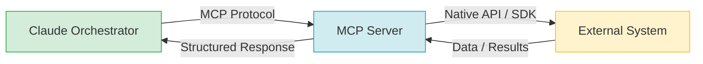
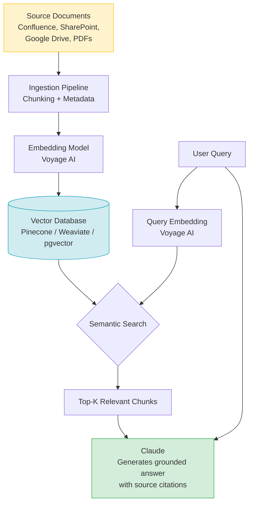
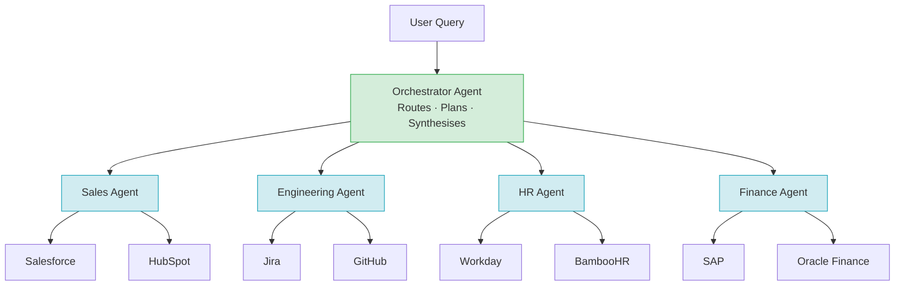

# 🏗️ Enterprise AI Hub Architecture

> **Powered by Claude** — A unified AI-powered chat interface connecting all enterprise systems

---

## Table of Contents

1. [Core Philosophy](#1-core-philosophy)
2. [🧠 Claude as the Central Brain](#2--claude-as-the-central-brain)
3. [🔌 Three Integration Strategies](#3--three-integration-strategies)
   - [Strategy A: Direct API Integration](#strategy-a-direct-api-integration)
   - [Strategy B: MCP (Model Context Protocol) Servers](#strategy-b-mcp-model-context-protocol-servers)
   - [Strategy C: Native AI in Business Systems](#strategy-c-native-ai-in-business-systems)
4. [🔐 Security & Governance](#4--security--governance)
5. [📚 Enterprise Knowledge Layer (RAG) — Phase 2](#5--enterprise-knowledge-layer-rag--phase-2)
6. [⚡ Automation Engine — Phase 2](#6--automation-engine--phase-2)
7. [🧩 Multi-Agent Evolution — Phase 3](#7--multi-agent-evolution--phase-3)
8. [📊 Observability & Continuous Improvement](#8--observability--continuous-improvement)
9. [Decision Matrix](#9-decision-matrix)
10. [Complete Architecture Diagram](#10-complete-architecture-diagram)
11. [Team Structure](#11-team-structure)
12. [Technology Stack Summary](#12-technology-stack-summary)
13. [Getting Started — First 30 Days](#13-getting-started--first-30-days)
14. [Phased Roadmap](#14-phased-roadmap)

---

## 1. Core Philosophy

The Enterprise AI Hub is built on three pillars:

1. **Claude as the central orchestration brain** — a single, powerful AI layer that understands natural language, reasons across domains, and routes work to the right systems.
2. **Three integration strategies** — Direct APIs for critical systems requiring full control; MCP (Model Context Protocol) servers for standardised AI-to-system connectivity; and Native AI bridges that leverage what vendors have already built (Salesforce Einstein, Atlassian Intelligence, ServiceNow AI).
3. **Progressive automation** — start with read-only queries, then add write actions, then multi-step workflows, and finally autonomous smart agents — all gated by appropriate governance.

The hub is not a replacement for the intelligence inside individual enterprise systems. It is the **layer that connects them**, synthesises insights across silos, and lets every employee interact with the entire enterprise through a single chat interface.

---

## 2. 🧠 Claude as the Central Brain

### Why Claude for Enterprise

| Capability | Details |
|---|---|
| **200K context window** | Analyse large documents, long conversation histories, and multi-system responses in a single pass |
| **Native tool use** | Structured function-calling to route queries to any system or API |
| **Structured output** | JSON-mode responses that integrate cleanly with downstream systems |
| **MCP support** | First-class support for the Model Context Protocol ecosystem |
| **Enterprise API** | Anthropic's API offers SLAs, rate limits, and compliance features suitable for enterprise workloads |
| **AWS Bedrock availability** | Deploy within your own AWS account for data residency and compliance requirements |

### Claude's Native Tool-Use for System Routing

Claude can call tools natively. At runtime, the hub passes a list of available tools (one per connected system). Claude decides which tools to invoke, in what order, and how to synthesise the results — no rigid rule-based routing required.

### Python Code Example — Tool Definitions

```python
import anthropic

client = anthropic.Anthropic()

tools = [
    {
        "name": "query_salesforce",
        "description": (
            "Query Salesforce CRM for accounts, opportunities, contacts, and cases. "
            "Use for questions about deals, customers, revenue, and pipeline."
        ),
        "input_schema": {
            "type": "object",
            "properties": {
                "soql": {
                    "type": "string",
                    "description": "SOQL query string to execute against Salesforce"
                }
            },
            "required": ["soql"]
        }
    },
    {
        "name": "query_jira",
        "description": (
            "Query Jira for issues, epics, sprints, and project status. "
            "Use for questions about engineering tickets, blockers, and delivery timelines."
        ),
        "input_schema": {
            "type": "object",
            "properties": {
                "jql": {
                    "type": "string",
                    "description": "JQL query string to execute against Jira"
                }
            },
            "required": ["jql"]
        }
    },
    {
        "name": "query_confluence",
        "description": "Search Confluence for documentation, policies, and knowledge base articles.",
        "input_schema": {
            "type": "object",
            "properties": {
                "query": {"type": "string", "description": "Full-text search query"},
                "space_key": {"type": "string", "description": "Optional Confluence space key"}
            },
            "required": ["query"]
        }
    },
    {
        "name": "query_workday",
        "description": "Query Workday HR system for org chart, employee data, and PTO information.",
        "input_schema": {
            "type": "object",
            "properties": {
                "resource": {
                    "type": "string",
                    "enum": ["employees", "org_chart", "time_off"],
                    "description": "The Workday resource to query"
                },
                "filters": {"type": "object", "description": "Optional filter parameters"}
            },
            "required": ["resource"]
        }
    }
]

def handle_tool_call(tool_name: str, tool_input: dict) -> str:
    """Dispatch tool calls to the appropriate connector."""
    # Each connector is registered in the connector registry
    connector = connector_registry.get(tool_name)
    if not connector:
        return f"Error: unknown tool '{tool_name}'"
    return connector.query(tool_input)

def ask_hub(user_message: str) -> str:
    messages = [{"role": "user", "content": user_message}]

    while True:
        response = client.messages.create(
            model="claude-opus-4-5",
            max_tokens=4096,
            tools=tools,
            messages=messages
        )

        if response.stop_reason == "end_turn":
            # Extract final text response
            return next(
                block.text for block in response.content
                if hasattr(block, "text")
            )

        # Process tool calls
        tool_results = []
        for block in response.content:
            if block.type == "tool_use":
                result = handle_tool_call(block.name, block.input)
                tool_results.append({
                    "type": "tool_result",
                    "tool_use_id": block.id,
                    "content": result
                })

        # Add assistant response and tool results to message history
        messages.append({"role": "assistant", "content": response.content})
        messages.append({"role": "user", "content": tool_results})
```

### Example Multi-System Query Flow

```
User: "What's the status of the Acme Corp deal and are there any
       blocking engineering tickets?"

Claude thinks:
  1. This needs Salesforce data (deal status)
  2. This needs Jira data (blocking tickets)
  → Calls query_salesforce with SOQL for Acme opportunity
  → Calls query_jira with JQL for blocking tickets linked to Acme

Results:
  Salesforce: Opportunity "Acme Corp Enterprise" — Negotiation, $450K, close date Q2
  Jira: 2 open P1 tickets — ACME-1042 (API timeout), ACME-1051 (SSO integration)

Claude synthesises:
  "The Acme Corp deal is currently in the Negotiation stage at $450K,
   targeted to close in Q2. There are 2 blocking P1 engineering tickets:
   ACME-1042 (API timeout issue) and ACME-1051 (SSO integration). These
   should be resolved before the close date to avoid deal risk."
```

---

## 3. 🔌 Three Integration Strategies

### Strategy A: Direct API Integration

#### When to Use
- Systems requiring write access (create, update, delete)
- Highly sensitive data requiring fine-grained access control
- Performance-critical integrations where latency matters
- Systems with no available MCP server
- Custom internal microservices

#### Example Systems

| System | Protocol | Key Data / Operations |
|---|---|---|
| Salesforce | REST API + SOQL | Accounts, Opportunities, Cases, Contacts |
| SAP | OData v4 / RFC | Financial data, Procurement, Inventory |
| Internal DBs | SQL (via API wrapper) | Custom business data, operational data |
| Custom microservices | REST / gRPC | Internal platforms, proprietary systems |
| Workday | REST API | HR, Payroll, Org chart |
| ServiceNow | REST API | ITSM tickets, Change management |

#### Pros
- Full control over authentication, authorisation, and data shaping
- Optimised performance — only fetch what you need
- Custom security policies per system

#### Cons
- More engineering effort to build and maintain each connector
- Each connector must be kept in sync with API changes
- Higher maintenance burden at scale

---

### Strategy B: MCP (Model Context Protocol) Servers

Anthropic's **Model Context Protocol (MCP)** is an open standard purpose-built for connecting AI models to external systems, data sources, and tools. MCP provides a standardised interface so Claude can communicate with any MCP-enabled system without bespoke integration code.

#### How MCP Works



#### Available & Emerging MCP Servers

| System | MCP Status | Notes |
|---|---|---|
| Google Drive | Available | File search, document read |
| Slack | Available | Channel history, messaging |
| GitHub | Available | Repos, issues, PRs, code search |
| PostgreSQL / MySQL | Available | Direct database queries |
| Confluence | Available / Emerging | Page search, content retrieval |
| Jira | Emerging | Issue queries, project data |
| SharePoint | Emerging | Document management |
| Salesforce | Emerging | CRM data via MCP |

#### What Your Engineers Build

1. **MCP host/client layer** — The hub component that speaks the MCP protocol and manages connections to MCP servers
2. **Custom MCP servers** — For internal systems that don't have a public MCP server yet (wrap your existing APIs)
3. **Security middleware** — Auth token injection, per-user permission scoping, and audit logging at the MCP layer

#### Pros
- Standardised protocol reduces custom integration code
- Growing open-source ecosystem of ready-made servers
- Claude's native MCP support means minimal glue code
- Community-maintained servers reduce long-term maintenance

#### Cons
- Less granular control compared to direct API integration
- Ecosystem still maturing — not all systems have production-ready servers
- Custom MCP servers still require engineering effort

---

### Strategy C: Native AI in Business Systems

Salesforce Einstein, Atlassian Intelligence, ServiceNow AI, and Microsoft Copilot are already embedded in their respective platforms and are optimised for their domain. Rather than duplicating this intelligence, the hub **calls their AI APIs** and lets Claude synthesise the results.

#### Example Flow

```
User: "What's the risk on closing Acme this quarter?"

Hub:
  1. Calls Salesforce Einstein → deal probability prediction + risk factors
  2. Calls Atlassian Intelligence → delivery risk on linked engineering work
  3. Claude synthesises both signals into a unified risk assessment
```

#### Pros
- Leverages years of vendor R&D and domain-specific model training
- Domain-optimised insights (Einstein on CRM data, Atlassian AI on project data)
- No need to replicate predictive models already built into the platform

#### Cons
- Dependent on vendor AI capabilities and API availability
- Limited control over the underlying model or prediction logic
- Vendor pricing for AI API calls adds cost per query

---

## 4. 🔐 Security & Governance

### Identity & Access

| Mechanism | Implementation |
|---|---|
| **SSO / Authentication** | Azure AD or Okta — every hub request is tied to an authenticated enterprise identity |
| **Token vaulting** | HashiCorp Vault — system API tokens and credentials stored and rotated centrally |
| **Per-user permission mapping** | The hub enforces the same permissions the user has in the source system — no privilege escalation |
| **Role-based tool access** | Salesforce reps cannot invoke HR tools; HR managers cannot invoke Finance write tools |

### Data Protection

| Concern | Solution |
|---|---|
| **Data residency** | Deploy Claude via AWS Bedrock within your AWS region; data never leaves your VPC |
| **PII handling** | PII detection layer strips or masks sensitive fields before returning to chat |
| **Audit trail** | Every query, tool call, and response logged to immutable audit store (e.g., CloudTrail + S3) |
| **Prompt injection** | Input sanitisation layer; Claude system prompt hardening; deny-listed instruction patterns |
| **Data in transit** | TLS 1.3 for all connections; mTLS for internal service-to-service communication |
| **Secrets in prompts** | Automated scanning prevents credentials appearing in conversation context |

### Claude Deployment Decision

| Factor | Anthropic API | AWS Bedrock |
|---|---|---|
| **Data residency** | Data processed by Anthropic | Stays within your AWS account/region |
| **Compliance** | Anthropic's BAA available | Inherits AWS compliance certifications (SOC2, HIPAA, etc.) |
| **Latency** | Dependent on Anthropic infra | Lower latency if workloads are in AWS |
| **MCP support** | Full MCP support | Full MCP support |
| **Pricing model** | Per-token API pricing | Per-token + AWS compute |
| **Recommended for** | Fastest time-to-value | Regulated industries, strict data residency |

---

## 5. 📚 Enterprise Knowledge Layer (RAG) — Phase 2

The RAG (Retrieval-Augmented Generation) layer enables the hub to answer questions grounded in your enterprise's own documents, policies, and institutional knowledge — beyond what live API queries can provide.

### RAG Pipeline



### Technology Recommendations

| Component | Recommendation | Notes |
|---|---|---|
| **Embeddings** | Voyage AI (`voyage-3`) | Best-in-class retrieval quality; Anthropic-recommended |
| **Vector DB** | Pinecone (managed) or pgvector (self-hosted) | Pinecone for scale; pgvector if you want to keep data in Postgres |
| **Alternative Vector DB** | Weaviate | Strong multi-tenancy support for enterprise |
| **Chunking strategy** | Semantic chunking | Respect document structure; avoid splitting mid-paragraph |
| **Metadata filtering** | System, space, date, access level | Ensures users only retrieve content they're permitted to see |

### Two Query Modes

| Mode | When Used | Example |
|---|---|---|
| **Live (API / MCP)** | Real-time operational data | "What's the current status of deal #4521?" |
| **Knowledge (Vector DB)** | Reference content, policies, documentation | "What's our expense reimbursement policy?" |

Claude selects the appropriate mode automatically based on query intent, or uses both in combination for complex questions.

---

## 6. ⚡ Automation Engine — Phase 2

### Capability Progression

| Phase | Capability | Examples |
|---|---|---|
| **Month 1–3: READ** | Query data across systems | "Show me open P1 tickets", "What's my pipeline for Q2?" |
| **Month 3–6: WRITE** | Simple write actions on systems | "Create a Jira ticket for this bug", "Update the Acme opportunity stage to Negotiation" |
| **Month 6–9: CHAIN** | Multi-step cross-system workflows | "When a deal closes, create an onboarding project in Jira and notify the CS team in Slack" |
| **Month 9–12: SMART** | Proactive, event-driven automations | "Alert me when a high-value deal has a P1 blocker and suggest a resolution path" |

### Safety Mechanisms

All write operations and automations include layered safety controls:

| Mechanism | Description |
|---|---|
| **Confirmation step** | User must confirm any write action before execution ("I'll create ticket PROJ-123. Confirm?") |
| **Approval workflows** | Sensitive operations (expense approval, org changes) routed to a designated approver |
| **Dry-run mode** | Preview what an automation would do before it executes — no side effects |
| **Rollback** | Reversible actions where possible; audit log enables manual rollback for irreversible ones |

---

## 7. 🧩 Multi-Agent Evolution — Phase 3

As the hub matures, a single orchestrator agent is augmented with specialised domain agents. Each domain agent has deep knowledge of its systems, data models, and tools.



### Inter-Agent Communication

Domain agents communicate via Claude's tool-use mechanism. The Orchestrator Agent can call a domain agent as a tool, passing a sub-query and receiving a structured result. This keeps the protocol consistent and observable throughout the system.

---

## 8. 📊 Observability & Continuous Improvement

| Metric | Description | Target |
|---|---|---|
| **Query success rate** | % of queries that return a useful, non-error response | > 95% |
| **System coverage** | % of connected systems available and responding | > 99.5% uptime |
| **Response latency (P95)** | End-to-end response time at 95th percentile | < 5 seconds |
| **User satisfaction score** | Thumbs up/down rating on responses | > 80% positive |
| **Token cost per query** | Average Claude token spend per interaction | Track and trend |
| **Monthly active users** | Adoption rate across the organisation | Grow month-over-month |
| **Automation success rate** | % of triggered automations that complete without error | > 98% |
| **Escalations / hallucination flags** | Queries flagged as inaccurate by users | < 1% |

---

## 9. Decision Matrix

| System | Strategy | Rationale |
|---|---|---|
| **Salesforce** | API + Native AI | Direct API for write operations; Einstein API for deal predictions |
| **Jira** | MCP + API | MCP server (emerging) for read queries; direct API for ticket creation |
| **Confluence** | MCP | MCP server available; read-heavy use case suits MCP well |
| **Slack** | MCP | Mature MCP server available; messaging and channel search |
| **GitHub** | MCP | Mature MCP server; code search, PRs, issues |
| **SAP** | API | Complex OData/RFC protocols; write access; sensitive financial data |
| **Workday** | API | Sensitive HR data; fine-grained permission requirements |
| **Internal DBs** | API | Custom schemas; direct SQL via API wrapper; full control needed |
| **Google Drive** | MCP | MCP server available; document search and retrieval |
| **SharePoint** | MCP | Emerging MCP server; document and knowledge retrieval |
| **ServiceNow** | API + Native AI | Direct API for ITSM operations; leverage ServiceNow AI for ticket categorisation |

---

## 10. Complete Architecture Diagram

```mermaid
graph TB
    subgraph USER["User Layer"]
        WC[Web Chat]
        SL[Slack Bot]
        TM[MS Teams Bot]
        MB[Mobile App]
    end

    subgraph SEC["Security & Governance Layer"]
        SSO[SSO — Azure AD / Okta]
        VAULT[Token Vault — HashiCorp Vault]
        PEL[Permission Engine]
        AUDIT[Audit Logger]
        PII[PII Filter]
    end

    subgraph CLAUDE["Claude Orchestration Layer"]
        OA[Orchestrator Agent<br/>Claude Opus]
        SA2[Sales Agent]
        EA2[Engineering Agent]
        HA2[HR Agent]
        FA2[Finance Agent]
        RAG[Knowledge / RAG Layer<br/>Voyage AI + Vector DB]
    end

    subgraph INT["Integration Layer"]
        subgraph API_COL["API Connectors"]
            SFC[Salesforce Connector]
            SAPC[SAP Connector]
            WDC[Workday Connector]
            DBC[DB Connector]
            SNC[ServiceNow Connector]
        end
        subgraph MCP_COL["MCP Servers"]
            GHM[GitHub MCP]
            SLM[Slack MCP]
            CFM[Confluence MCP]
            GDM[Google Drive MCP]
            PGM[PostgreSQL MCP]
        end
        subgraph NAI_COL["Native AI Bridges"]
            EIN[Salesforce Einstein]
            ATI[Atlassian Intelligence]
            SNI[ServiceNow AI]
        end
    end

    subgraph AUTO["Automation Layer"]
        AX[Action Executor]
        WE[Workflow Engine]
        APR[Approval System]
        EB[Event Bus]
    end

    subgraph OBS["Observability Layer"]
        METRICS[Metrics & Dashboards]
        LOGS[Centralised Logging]
        TRACE[Distributed Tracing]
        FEED[User Feedback Loop]
    end

    WC & SL & TM & MB --> SSO
    SSO --> PEL
    PEL --> OA
    VAULT --> OA
    PII --> OA
    OA --> AUDIT

    OA --> SA2 & EA2 & HA2 & FA2
    OA --> RAG

    SA2 --> SFC & EIN
    EA2 --> GHM & CFM
    HA2 --> WDC
    FA2 --> SAPC
    OA --> SLM & GDM & PGM & SNC & DBC

    OA --> AX
    AX --> WE
    WE --> APR
    EB --> OA

    OA --> METRICS & LOGS & TRACE
    FEED --> OA
```



---

## 11. Team Structure

| Role | Responsibility | Headcount |
|---|---|---|
| **Tech Lead / Architect** | Overall architecture, design decisions, cross-team alignment | 1 |
| **AI / LLM Engineers** | Prompt engineering, RAG pipeline, agent framework, tool definitions | 2–3 |
| **Backend Engineers** | Connector framework, MCP client layer, API integrations, security | 3–4 |
| **Platform / DevOps** | Infrastructure (Kubernetes/ECS), CI/CD, secrets management, monitoring | 1–2 |
| **Data Engineer** | ETL pipelines, vector DB ingestion, embedding pipeline, data quality | 1–2 |
| **Frontend Engineer** | Chat UI, real-time WebSocket, user feedback components | 1 |
| **Product Owner** | Roadmap, stakeholder management, user research, prioritisation | 1 |

**Total: 10–14 engineers**

---

## 12. Technology Stack Summary

| Layer | Technology |
|---|---|
| **Frontend** | React / Next.js + WebSocket for real-time chat streaming |
| **AI Engine** | Claude (Anthropic API or AWS Bedrock) |
| **Agent Framework** | Anthropic SDK with native tool use + custom orchestration |
| **MCP Client** | Anthropic MCP SDK (TypeScript / Python) |
| **Embeddings** | Voyage AI (`voyage-3`) |
| **Vector Database** | Pinecone (managed) or pgvector / Weaviate (self-hosted) |
| **API Gateway** | Kong / AWS API Gateway |
| **Auth** | Azure AD / Okta (SSO + OAuth 2.0 + RBAC) |
| **Secret Management** | HashiCorp Vault |
| **Event Bus** | Apache Kafka / AWS EventBridge |
| **Workflow Engine** | Temporal / Apache Airflow |
| **Infrastructure** | Kubernetes (EKS / AKS) or AWS ECS |
| **Monitoring** | Datadog / Grafana + Prometheus |
| **Logging** | OpenTelemetry → Elasticsearch / CloudWatch |

---

## 13. Getting Started — First 30 Days

| Week | Actions | Milestone |
|---|---|---|
| **Week 1** | Set up repo, development environment, and Claude API access. Deploy minimal chat UI with direct Claude integration. Implement SSO. | "Hello World" chat authenticated via SSO |
| **Week 2** | Build the connector framework base class and registry. Implement the first two connectors (e.g., Jira + Confluence). Define tool schemas for Claude. | Claude can answer Jira/Confluence questions |
| **Week 3** | Add the Salesforce connector. Implement PII filtering and audit logging. Set up per-user permission mapping from SSO groups. | Multi-system queries working with basic governance |
| **Week 4** | Internal demo with pilot users (10–20 people). Collect feedback. Add observability (basic metrics + logging). Fix top issues. | **Working prototype in production for pilot users** |

---

## 14. Phased Roadmap

### Phase 1 — Foundation (Months 1–3)

**Goal:** A working, secure, read-only AI hub connected to the top 5 enterprise systems.

- Claude orchestration layer with native tool use
- Connector framework + connectors for Salesforce, Jira, Confluence, Workday, Internal DBs
- SSO authentication + per-user permission mapping
- PII filtering + audit logging
- Web chat UI + Slack bot
- Basic observability (query metrics, latency, error rates)

### Phase 2 — Knowledge & Automation (Months 3–6)

**Goal:** Enrich answers with enterprise knowledge; enable write actions with safety controls.

- RAG pipeline (Voyage AI embeddings + Pinecone/pgvector)
- Document ingestion from Confluence, SharePoint, Google Drive
- Write-action connectors (create Jira ticket, update Salesforce opportunity)
- Automation engine: Action Executor + Approval System + Workflow Engine
- MCP server integrations (GitHub, Slack, Google Drive)
- Native AI bridges (Salesforce Einstein, Atlassian Intelligence)

### Phase 3 — Scale & Mature (Months 6–12)

**Goal:** Multi-agent architecture, proactive automations, and enterprise-wide adoption.

- Domain agents (Sales, Engineering, HR, Finance)
- Event-driven automations via Event Bus
- Multi-step cross-system workflows (Temporal)
- Advanced observability + user feedback loop + A/B prompt testing
- Mobile app
- Expanded system coverage (SAP, ServiceNow, Oracle, GitHub Actions)
- Governance dashboard for administrators
